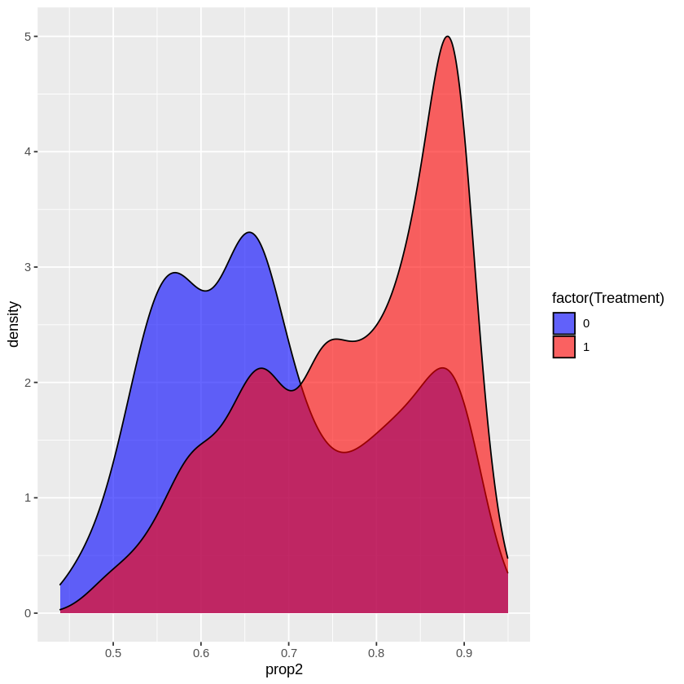
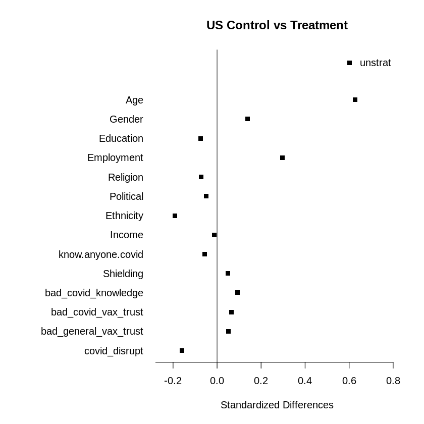
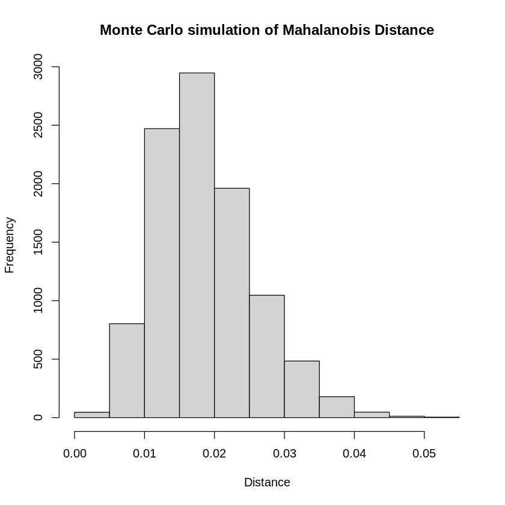

# CovariateImbalance
Reanalysis of COVID Vaccination Intent study identifying covariate imbalances

  

This project was done with Quentin Hsu and Zhongren Chen and was our final project for the class Statistics 209 (2021 Fall). We reanalyzed a randomized controlled trial which exposed participants to online misinformation and measured its impact in vaccination intent. Our analysis show that the treatment assignment randomization had significant imbalance, which bias the estimates of the study. Moreover, we reduce this bias by applying matching estimators and performing regression adjustment.

  
   
  

